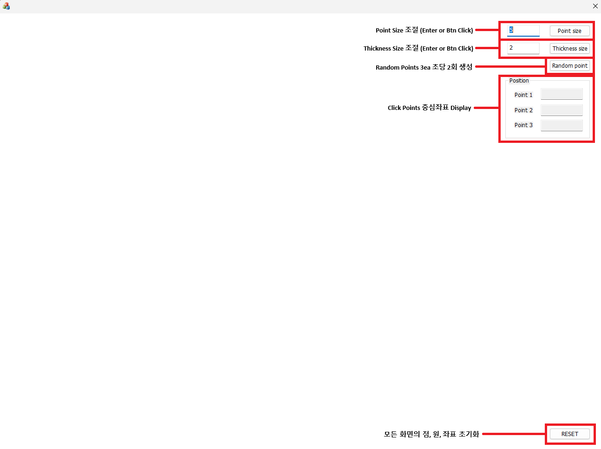

# circle_editor_MFC

## 파일구조

```
circle_editor_MFC/
└── circle_editor_MFC/
    ├── circle_editor_MFCDlg.cpp  # 대화 상자(UI) 구현: 사용자 입력, 화면 갱신, 메시지 처리
    ├── CircleUtils.cpp           # 세 점으로 이루어진 외접원의 중심과 반지름 계산
    ├── DrawManager.cpp           # 버퍼 생성 및 점·원 그리기 로직
    ├── PointManager.cpp          # 점 추가, 이동, 히트 테스트 등 점 상태 관리
    └── RandomAnimator.cpp        # 백그라운드 스레드에서 점을 랜덤하게 이동하는 애니메이션 모듈
```

## 참고 이미지


